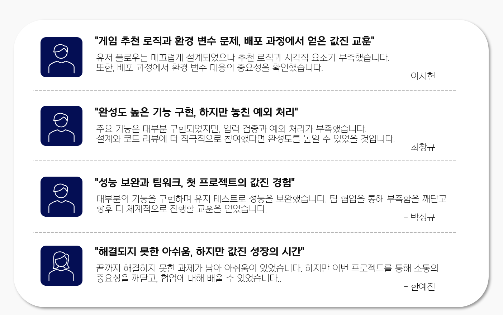

  

  
## 📌 버전 업데이트 내역 (Release Notes)

<h2> [v1.2.0] (25.01.30 ~ ) </h2>
<blockquote style="background:#f8f9fa; border-left:5px solid #1E3A5F; padding:15px;">
  🐞 <b>버그 수정 및 개선 사항</b>  
  - 챗봇 응답 속도 최적화 및 로딩 시간 단축  
  - 챗봇 응답이 잘리는 문제 해결  
  - 리뷰 수정 및 삭제 기능 추가
</blockquote>

---

<h2> [v1.1.0] (25.01.27 ~ 29) </h2>
<blockquote style="background:#f8f9fa; border-left:5px solid #1E3A5F; padding:15px;">
  ✅ <b>새로운 기능</b>  
  - 사용자의 취향을 분석해 <b>자동 추천 시스템</b> 추가  
  - 특정 게임과 유사한 게임을 추천하는 기능 추가
</blockquote>
<blockquote style="background:#f8f9fa; border-left:5px solid #1E3A5F; padding:15px;">
  🐞 <b>버그 수정 및 개선 사항</b>  
  - 일부 화면 깨짐 수정  
  - 화면 로딩 속도 개선  
  - 게임 세부 정보 부족 문제 해결
</blockquote>

---

<h2> [v1.0.0] (25.01.24 ~ 26) </h2>
<blockquote style="background:#f8f9fa; border-left:5px solid #1E3A5F; padding:15px;">
  ✅ <b>새로운 기능</b>  
  - 게임 검색 기능 개선 (검색 기준 완화)  
  - 회원가입 시 게임 관심사 선택 기능 추가
</blockquote>
<blockquote style="background:#f8f9fa; border-left:5px solid #1E3A5F; padding:15px;">
  🚀 <b>최초 테스트</b>  
  - 게임 추천 및 검색 기능 제공  
  - 기본적인 챗봇 서비스 지원  
  - 사용자 리뷰 및 평점 시스템 도입
</blockquote>

<h1>1. 프로젝트 개요</h1>

---
<h2> [아이디어 배경]</h2>
<blockquote style="background:#f8f9fa; border-left:5px solid #1E3A5F; padding:15px;">
  현대의 방대한 게임 시장에서 사용자들은 자신에게 적합한 게임을 찾는 데 <b>어려움</b>을 겪고 있습니다.  
  마치 복잡한 사건을 해결하는 탐정처럼, 사용자들은 신뢰할 수 있는 조수와 동료의 도움이 절실합니다.  
  셜록과 <b>왓슨</b>이 서로의 강점을 보완하며 사건을 해결하듯, <b>스팀</b>과 <b>사용자</b>를 효과적으로 연결하여
  최적의 게임 선택 경험을 제공하는 시스템을 개발하고 싶었습니다.
</blockquote>

<h2> [WATSON 기획]</h2>
<blockquote style="background:#f8f9fa; border-left:5px solid #1E3A5F; padding:15px;">
  <b>WATSON</b>은 이러한 문제를 해결하기 위해 탄생한 혁신적인 <b>게임 추천 플랫폼</b>입니다.  
  <b>WATSON</b>은 사용자들이 방대한 게임 속에서 혼자 고민하거나 여러 정보를 헤매지 않고도,  
  손쉽고 즐겁게 자신에게 맞는 게임을 찾을 수 있도록 지원합니다.  
  이를 통해 게임 선택 과정의 <b>스트레스를 줄이고</b>, 보다 <b>만족스러운 게임 경험</b>을 제공하는 것을 목표로 합니다.
</blockquote>

---

  <table style="border-left: 5px solid #1E3A5F; border-radius: 10px; border-collapse: collapse;">
    <tr style="background-color:#f2f2f2;">
      <th> <b>개발 기간</b></th>
      <th> <b>팀원</b></th>
      <th> <b>SA 문서</b></th>
      <th> <b>프론트엔드 레포</b></th>
    </tr>
    <tr>
      <td align="center"><b>12월 30일 ~ 1월 31일</b></td>
      <td align="center">이시헌, 최창규, 한예진, 박성규</td>
      <td align="center">
        <a href="https://teamsparta.notion.site/SA-cf3c8aa1c4df477a9e0675720f4eac2d">
           SA 문서 바로가기
        </a>
      </td>
      <td align="center">
        <a href="https://github.com/teamN-watson/watson-frontend">
           Watson Frontend Repo
        </a>
      </td>
    </tr>
  </table>

---
 
<h1>2. 서비스 소개</h1>

### 서비스 시연 영상

  

### 서비스 아키텍처

  

  <table width="100%" style="border-collapse: collapse;">
    <tr style="background-color:#f2f2f2;">
      <th style="text-align:center; padding: 10px;"><b>카테고리</b></th>
      <th style="text-align:center; padding: 10px;"><b>기술 및 설명</b></th>
    </tr>
    <tr>
      <td align="center" style="padding: 10px;"><b>백엔드</b></td>
      <td align="left" style="padding: 10px;">
        - <b>Django REST Framework (DRF)</b> 기반의 RESTful API 서버 구축  
        - <b>PostgreSQL</b>을 사용한 관계형 데이터베이스 관리  
        - <b>JWT (JSON Web Token)</b> 기반 인증 및 <b>Steam OpenID</b> 연동
      </td>
    </tr>
    <tr>
      <td align="center" style="padding: 10px;"><b>프론트엔드</b></td>
      <td align="left" style="padding: 10px;">
        - <b>React</b>를 사용하여 사용자 인터페이스(UI) 개발  
        - <b>API 연동</b>을 통한 데이터 처리 및 화면 렌더링  
        - <b>반응형 웹 디자인</b> 적용
      </td>
    </tr>
    <tr>
      <td align="center" style="padding: 10px;"><b>인프라 및 배포</b></td>
      <td align="left" style="padding: 10px;">
        - <b>AWS EC2 (t2 인스턴스)</b>: 애플리케이션 서버 호스팅  
        - <b>AWS S3</b>: 사용자 업로드 파일 및 정적 리소스 저장  
        - <b>Docker</b> 컨테이너를 활용한 배포 환경 구성
      </td>
    </tr>
    <tr>
      <td align="center" style="padding: 10px;"><b>AI 및 데이터 처리</b></td>
      <td align="left" style="padding: 10px;">
        - <b>OpenAI API</b>를 활용한 AI 챗봇 기능 제공  
        - <b>BeautifulSoup</b>을 활용한 Steam 리뷰 데이터 크롤링 및 분석
      </td>
    </tr>
    <tr>
      <td align="center" style="padding: 10px;"><b>보안 및 인증</b></td>
      <td align="left" style="padding: 10px;">
        - <b>JWT 기반 사용자 인증</b>을 통한 보안 강화  
        - <b>Steam OpenID</b> 연동을 통한 간편 로그인 지원
      </td>
    </tr>
  </table>

### 서비스 플로우

  
   
  🔗 이미지를 클릭하면 Figma에서 서비스 플로우를 확인할 수 있습니다.

---

### 챗봇 플로우

  
   
  🔗 이미지를 클릭하면 Figma에서 챗봇 플로우를 확인할 수 있습니다.

<h1>3. WATSON 기능</h1>

## 😀 유저

> **회원가입**
> - 기본 로그인 / 로그아웃 기능 제공  
> - 스팀 계정 연동 **여 / 부 선택 가능** (회원가입 첫 화면 or 마이페이지)  
> - 사용자가 관심 있는 게임을 선택할 수 있는 기능 제공 → 추천 알고리즘 초기 데이터로 활용  

  

> **스팀 정보 연동**
> - 스팀 계정과 연동하여 유저 정보를 자동으로 가져올 수 있는 기능 제공  
> - 유저의 스팀 게임목록, 플레이 시간, 리뷰 데이터를 기반으로 정교한 맞춤형 서비스 제공  
> - 스팀 프로필 사진을 프로필에 자동으로 업데이트

  

---

## 🏠 홈 알고리즘 추천
> **사용자 맞춤 게임 추천**  
> - 알고리즘을 통해 회원가입 시 등록 유저 정보와 스팀 연동 정보를 기반으로 사용자 맞춤형 게임 추천  
> - 추천된 게임은 **사용자 기반 순위별로 제공**되어 유저가 쉽게 새로운 게임을 발견할 수 있도록 지원  

  

---

## 🎮 게임 상세
> **게임 정보 제공**
> - 게임 제목, 장르, 출시일, 개발사, 메타 크리틱 점수 제공
> - 스크린샷 및 주요 이미지 표시
> - 해당 게임에 대한 유저들의 리뷰 제공
> - 관련 유튜브 영상 제공
> - 전체 리뷰들의 대한 평점과 개수 정보 제공

  

---

## 💬 챗봇
> **게임 추천 기능**  
> - “ ~한 게임 추천해줘 “ 라는 사용자 요구에 맞춰 적합한 게임을 추천  
> - 회원 가입 시 입력된 **게임**, 스팀 연동 시 리뷰/플레이 타임 정보를 참고해 **사용자 맞춤 추천**  
> - 게임 추천과 동시에 다른 유저들의 리뷰를 참고해 **해당 게임의 장점과 단점을 요약 및 제공**  

  

> **게임 정보 탐색 기능**  
> - 특정한 게임에 대한 정보가 알고 싶을 때 해당 게임에 대한 정보를 제공  
> - “ ~에 대해 알려줘” 라는 사용자 요구에 가장 알맞는 게임에 대한 정보 제공  
> - 게임 설명 및 다른 유저들의 리뷰 정보를 통한 장점/단점 정보 제공  

  

---

## 📃 리뷰
> **리뷰 작성 및 수정 기능**  
> - 유저가 특정 게임에 대한 리뷰를 작성하거나 기존 리뷰를 수정할 수 있는 기능 제공  
> - 리뷰 작성 및 수정 시 **중복 검사를 통해 동일한 게임 중복 리뷰 방지**  

  

> **부가 기능**  
> - **리뷰 상세 조회** : 특정 게임에 대해 작성된 리뷰를 상세히 조회할 수 있는 기능 제공  
> - **리뷰 평가** : 리뷰 작성 시 (0.5~5.0점) 별점을 매길 수 있는 기능 제공  
> - **리뷰 추천** : 유저들의 해당 리뷰 추천/비추천 기능 제공  
> - **리뷰 댓글** : 특정 리뷰에 대한 댓글 기능 제공  
> - **리뷰 삭제** : 작성한 사용자의 리뷰 삭제 기능  
> - **리뷰 탐색** : 검색을 통한 리뷰 탐색 기능  

  

---

## 4. ERD (Entity Relationship Diagram)

서비스에서 사용되는 데이터 모델 구조를 시각적으로 표현한 ERD입니다.
아래 다이어그램을 통해 테이블 간의 관계를 쉽게 이해할 수 있습니다.

  

---
## 5. 멤버 및 역할

  

---

## 6. 회고

  

### 📑 추가 문서 링크

  <table>
    <tr style="background-color:#f2f2f2;">
      <th> <b>문서명</b> </th>
      <th> <b>링크</b> </th>
    </tr>
    <tr>
      <td align="center"><b>SRS 문서</b></td>
      <td align="center">
        <a href="https://www.notion.so/teamsparta/3fd72d1250264d55b030ca35fb2dd9d7?v=8af101068c654e83b9d62a3e0eca954d">
          SRS 문서 바로가기
        </a>
      </td>
    </tr>
    <tr>
      <td align="center"><b>API 명세서</b></td>
      <td align="center">
        <a href="https://www.notion.so/teamsparta/65de935d24ae477880c5756718e66e87?v=5ae0cfc3dc194e8eba9dee40dc621cf6">
          API 명세서 바로가기
        </a>
      </td>
    </tr>
    <tr>
      <td align="center"><b>트러블 슈팅</b></td>
      <td align="center">
        <a href="https://www.notion.so/teamsparta/1be2d6f4fd774ddd969573563ab8d13c?v=320cd5f2e9804ab192c22ddd2d543c86">
          트러블 슈팅 바로가기
        </a>
      </td>
    </tr>
  </table>

